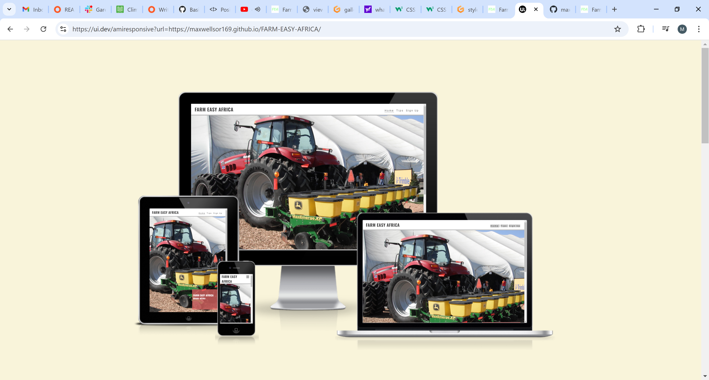
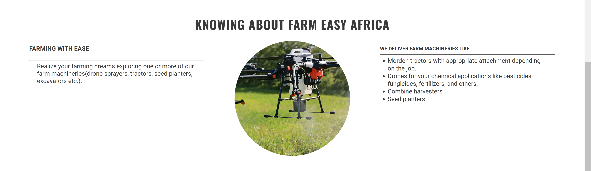
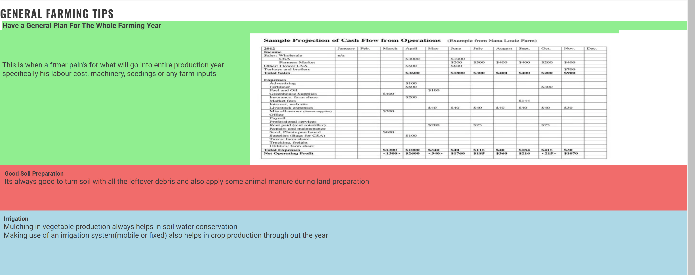

# Farm Easy Africa

The Farm Easy Africa website is a landing page for local africas(Ghanaian) farmers who are looking for major and minor farm equipment or machinery for hiring to help them actualizing their farming dreams.

Users of this website will get to know about our main objective, the machineries we deliver, our contact, general farming tips and how to sign up.

## Features
* Navigation
    * On the navigation is the business name at the top left corner of the page: FARM EASY AFRICA that links to the top of the page.
    * Home, Tips, and Sign Up are the other navigation links which leads the user to the different section of the website.
    * The navigation clearly spells the name of the business and helps users to know the other sections of the website.

### Existing Features

 * The Header
     * The header shows all three navigation sections of the webpage with clickable links. It also contains the link for the logo. It is found same on all the pages.
     * The header clearly spells out who the page is ment for.
     * The helps a user to access every page with ease.

  

  * The landing image
    * The image includes a photograph with an overlay text describing to users the location of the business.
    * This photo present to the user what we offer with a catchy animation.

  * Knowing About Farm Easy Africa Section
    * This part of the home page addresses the business's core objectives.
    * This section also highlights some of the services the business gives out to its customers. 

    

 * The Footer
   * The footer contains the links to the different social media sites where users can contact us.

   

* Tips
   * This part of the page elaborates on some basic and common general farming practices to help farmers and individuals who use our page for education and business purposes.

* Sign Up Page
    * The page allows the user to sign up and book a section for our services.
    * The paeg gives you two options to select from telling us what services you want.

    
          

